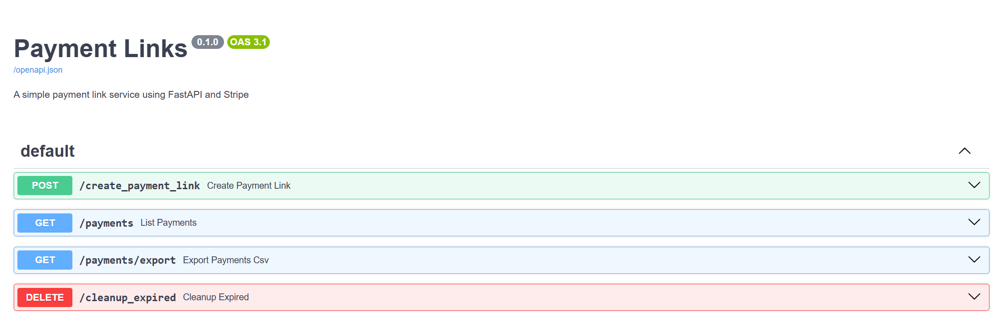
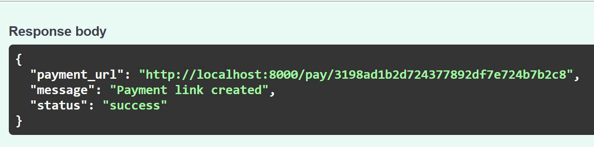
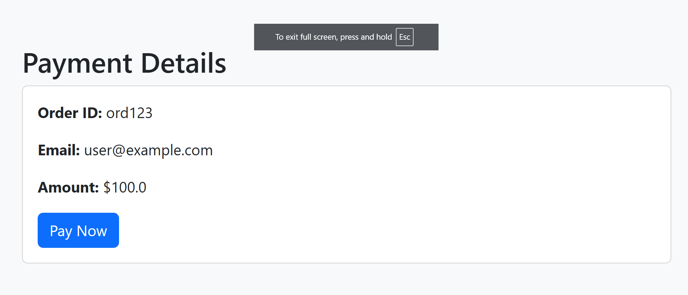
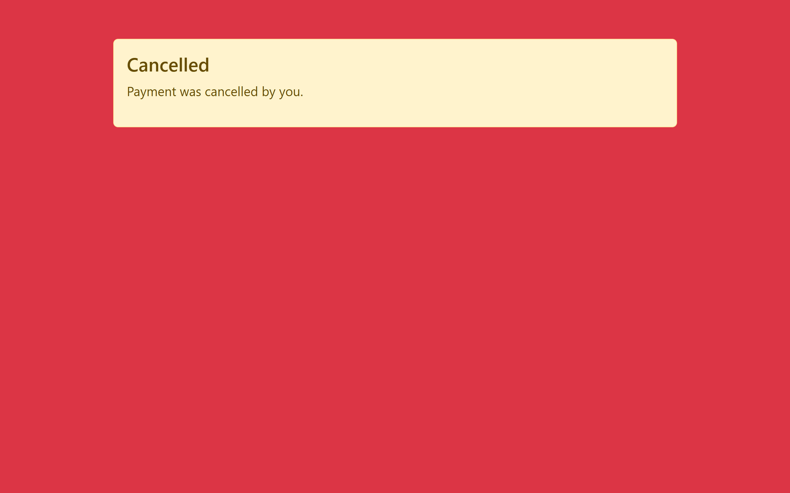
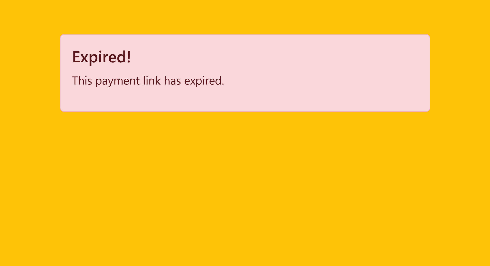

# Payment Link System

A FastAPI-based application that integrates with Stripe to create and manage payment links. Users can generate payment links, process payments through Stripe Checkout, and track the payment status.

## Features
- Generate unique payment links.
- Stripe Checkout integration for secure payments.
- Payment links expire after 5 minutes.
- View payment statuses (Pending, Paid, Expired).
- Export payment data to CSV.

## Screenshots
#### Home Page


#### Payment Link


#### Payment Page


#### Success Page


#### Cancelled Page


#### Expired Page



## Configuration
- Set your Stripe API keys in the `.env` file:
  ```
  STRIPE_PUBLIC_KEY=<your_public_key>
  STRIPE_SECRET_KEY=<your_secret_key>
  ```
## Run
`uvicorn main:app --reload`